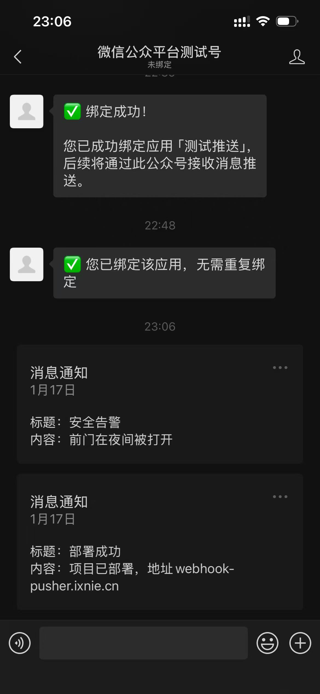

# EdgeOne Webhook Pusher

> 🚀 **0成本自建微信推送** - 白嫖EdgeOne + 微信测试号，5分钟部署专属推送服务

[](https://edgeone.ai/pages/new?template=https://github.com/ixNieStudio/edgeone-webhook-pusher)

**🎯 在线体验**：[https://webhook-pusher.ixnie.cn/](https://webhook-pusher.ixnie.cn/) （仅供体验使用）

---

## 💡 为什么选它？

| 对比项 | 本项目 | Server酱 | 认证公众号 |
|--------|--------|----------|-----------|
| � 成本 | **完全免费** | ¥49/年起 | 需认证费 |
| 🔒 数据归属 | **自建自托管** | 第三方托管 | 腾讯托管 |
| ⚡ 部署难度 | **5分钟一键部署** | 简单 | 复杂 |
| 📊 推送限制 | **无限制** | 免费版有限 | 48小时限制 |
| 🛠️ 自定义 | **完全可控** | 有限 | 有限 |

**核心卖点**：EdgeOne免费额度 + 微信测试号 = 0成本永久使用 + 数据完全自己掌控

> 由 [Tencent EdgeOne](https://edgeone.ai) 提供全球CDN加速

---

## 📸 产品截图

<table>
  <tr>
    <td></td>
    <td></td>
    <td></td>
  </tr>
  <tr>
    <td align="center">微信推送效果</td>
    <td align="center">首页概览</td>
    <td align="center">渠道管理</td>
  </tr>
  <tr>
    <td></td>
    <td></td>
    <td></td>
  </tr>
  <tr>
    <td align="center">应用管理</td>
    <td align="center">消息历史</td>
    <td align="center">登录页面</td>
  </tr>
</table>

---

## ✨ 核心功能

- 🆓 **完全免费**：无推送次数/时间限制
- ⚡ **极速部署**：EdgeOne一键部署，无需服务器
- 📡 **Webhook调用**：一行代码/浏览器直接推送
- 📱 **双消息模式**：模板消息 + 客服消息
- 🎛️ **可视化管理**：Web界面管理渠道/应用/历史
- 🏠 **数据自托管**：部署在个人账号，安全可控
- 🎁 **体验模式**：免登录试用全部功能
- 🌍 **全球加速**：EdgeOne边缘节点低延迟

---

## 🎯 适用场景

**HomeLab/智能家居**：NAS下载通知、路由器监控、HomeAssistant告警、树莓派传感器  
**开发运维**：CI/CD通知、服务器监控、Docker告警、错误提醒  
**自动化工作流**：爬虫结果、签到脚本、RSS订阅、价格监控  
**生活服务**：快递提醒、日程通知、设备上线

---

## 🚀 快速开始

### 方式1：在线体验
访问 [https://webhook-pusher.ixnie.cn/](https://webhook-pusher.ixnie.cn/)，免部署体验全部功能

### 方式2：一键部署（5分钟）

1. 点击顶部「Deploy to EdgeOne」按钮，登录EdgeOne账号
2. 绑定5个KV命名空间：`CONFIG_KV`、`CHANNELS_KV`、`APPS_KV`、`OPENIDS_KV`、`MESSAGES_KV`
3. 配置构建参数（Root: `/`，Output: `dist`，Build: `yarn build`）
4. **⚠️ 重要：配置环境变量**
   - 在 EdgeOne 项目设置中添加环境变量：
   - `KV_BASE_URL=https://your-custom-domain.com`（替换为你的自定义域名）
   - 如果使用 EdgeOne 默认域名，则设置为：`KV_BASE_URL=https://your-project.edgeone.cool`

> 💡 **为什么需要配置 KV_BASE_URL？**  
> EdgeOne Node Functions 需要通过 Edge Functions 访问 KV 存储。直接访问 `/send/*` 接口时，系统无法自动检测到公共域名，必须手动配置环境变量指定完整的域名地址。

### 使用流程

1. **申请测试号**：访问 [微信测试号申请页](https://mp.weixin.qq.com/debug/cgi-bin/sandbox?t=sandbox/login)，扫码获取AppID/AppSecret
2. **创建渠道**：填入测试号信息，配置服务器URL和Token
3. **创建应用**：选择推送模式（单播/订阅）、消息类型，填入模板ID
4. **绑定用户**：生成绑定码，微信扫码完成绑定
5. **发送消息**：
   ```bash
   # GET请求
   curl "https://your-domain.com/send/{appKey}?title=标题&desp=内容"
   
   # POST请求
   curl -X POST "https://your-domain.com/send/{appKey}" \
     -H "Content-Type: application/json" \
     -d '{"title":"标题","desp":"内容"}'
   ```

---

## 🔌 集成示例

### 群晖NAS下载通知
```bash
curl "https://your-domain.com/send/{appKey}?title=下载完成&desp=${TR_TORRENT_NAME}"
```

### GitHub Actions部署通知
```yaml
- name: 部署通知
  run: curl "https://your-domain.com/send/${{ secrets.WEBHOOK_KEY }}?title=部署成功&desp=项目已上线"
```

### Home Assistant告警
```yaml
notify:
  - name: webhook_pusher
    platform: rest
    resource: https://your-domain.com/send/{appKey}
    method: POST
    data:
      title: "{{ title }}"
      desp: "{{ message }}"
```

### 服务器监控
```bash
CPU_USAGE=$(top -bn1 | grep "Cpu(s)" | awk '{print $2}')
[ ${CPU_USAGE%.*} -gt 80 ] && curl "https://your-domain.com/send/{appKey}?title=CPU告警&desp=使用率${CPU_USAGE}%"
```

---

## 🔐 管理员密码自定义

系统支持自定义管理员密码功能，让您可以设置易于记忆但符合安全要求的密码。

### 密码复杂度要求

为确保系统安全，自定义密码必须满足以下要求：

- ✅ **长度**：至少 12 个字符
- ✅ **大写字母**：包含至少一个大写字母 (A-Z)
- ✅ **小写字母**：包含至少一个小写字母 (a-z)
- ✅ **数字**：包含至少一个数字 (0-9)
- ✅ **特殊字符**：包含至少一个特殊字符 (!@#$%^&*()_+-=[]{}|;:,.<>?)

**示例有效密码**：`MySecure@Pass123`、`Admin#2024Strong`

### 使用方法

1. **登录管理后台**：使用当前管理员令牌登录
2. **进入设置页面**：点击右上角设置图标
3. **重置密码**：
   - 选择「自定义密码」选项
   - 输入新密码（需满足复杂度要求）
   - 再次输入确认密码
   - 系统会实时显示密码强度和复杂度检查结果
4. **确认重置**：点击「确认重置」按钮
5. **重新登录**：使用新密码登录系统

### 向后兼容性

- 🔄 **自动生成模式**：如果不选择自定义密码，系统仍会自动生成安全的随机令牌（保持原有行为）
- 🔒 **即时生效**：密码重置后，旧令牌立即失效，需使用新密码重新登录
- 📱 **前端兼容**：旧版本前端仍可正常使用自动生成模式

### 安全提示

- ⚠️ **妥善保管**：请务必记住您的自定义密码，系统不提供密码找回功能
- 🔐 **定期更换**：建议定期更换管理员密码以提高安全性
- 🚫 **避免弱密码**：不要使用常见密码或个人信息作为密码

---

## ❓ 常见问题

**Q: 测试号有什么优势？**  
A: 自定义模板、突破48小时限制、免审核，比正式号更灵活

**Q: 单播和订阅的区别？**  
A: 单播推给首个绑定用户（个人），订阅推给所有绑定用户（群组）

**Q: EdgeOne免费额度够用吗？**  
A: 每月100GB流量 + 100万次请求，个人使用完全够

**Q: 忘记自定义密码怎么办？**  
A: 需要通过 EdgeOne 控制台的 KV 存储直接修改配置，或重新部署项目

**Q: 密码复杂度要求可以调整吗？**  
A: 密码复杂度要求是为了保护系统安全而设定的，不建议降低要求

---

## 🤝 参与贡献

- 📝 提交Issue/PR：[GitHub Issues](https://github.com/ixNieStudio/edgeone-webhook-pusher/issues)
- 💬 交流讨论：[GitHub Discussions](https://github.com/ixNieStudio/edgeone-webhook-pusher/discussions)
- 🎁 分享案例：欢迎分享你的使用场景

---

## 📄 开源协议

GPL-3.0 License

---

**关键词**：微信推送 | EdgeOne | Serverless | 数据自托管 | Server酱替代 | NAS通知 | 群晖 | 服务器监控 | CI/CD | HomeAssistant | 智能家居 | 免费推送
